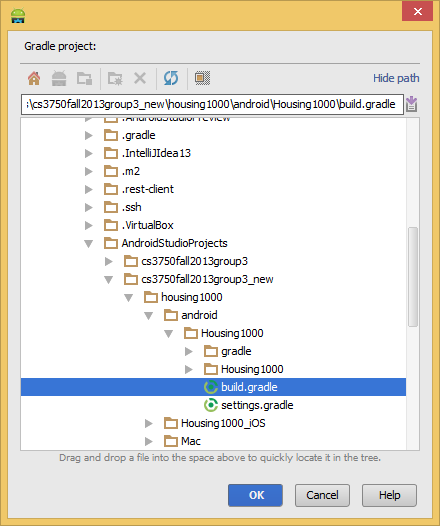

CTAGroup Android/iOS Survey Apps
==========================

The goal of these mobile apps is to allow a user to conduct surveys from Android/iOS devices on site.  This includes capturing the interviewee's signature, taking any relevant photos, and submitting answers to the survey questions.  The surveys and questions are pulled from a server and the UI for them is dynamically generated in the mobile apps.

A Point In Time (PIT) survey is also available, which allows the user to get general info on a group of people, such as the number of males/females, age groups, etc.

#Setup Guide#

##Android##

- Download and install **[Android Studio](http://tools.android.com/download/studio/canary)** ([IntelliJ IDEA](http://www.jetbrains.com/idea/) can also be used, but Android Studio will most likely be easier to set up since it includes the Android SDK etc.)
- Make sure that you have the latest Android SDK updates in your SDK Manager
- Start Android Studio.  You should be presented with a "Welcome to Android Studio" screen.  If not, you most likely have a project open. If so, go to File -> Close
- From the welcome screen, choose "Check out from version control," then **GitHub**
- Put in your github credentials and clone this repository

- Choose "Import project from external model," then **Gradle**
- Point the top text box to the **build.gradle** file located in the "housing1000/android/Housing1000" folder, use the **default gradle wrapper** and click **Finish**

> The project should now be imported.  However, you will most likely be met with a few errors:

> - Android studio might complain about your VCS root path. Click configure to fix it. Make sure that the "Project" one is set to **None**.  Android studio will recommend another path in that dialog for you to use.
> - There will be several objects in your project that are highlighted red.  This is because the project hasn't been built yet and you are also missing some libraries. There is a Sync Gradle button on the top toolbar that will download any missing dependencies and build things for you.

##iOS##

- TODO