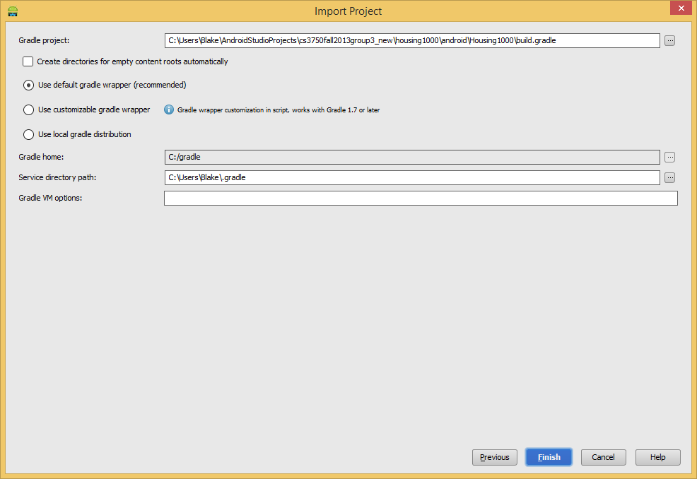
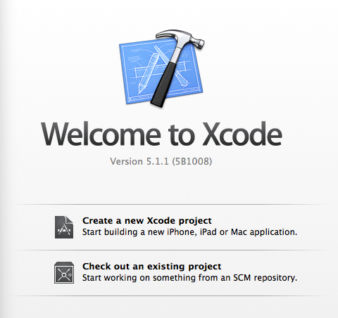

CTAGroup Android/iOS Survey Apps
================================

The goal of these mobile apps is to allow a user to conduct surveys from Android/iOS devices on site.  This includes capturing the interviewee's signature, taking any relevant photos, and submitting answers to the survey questions.  The surveys and questions are pulled from a remote server and the UI for them is dynamically generated in the mobile apps.

A Point In Time (PIT) survey is also available, which allows the user to fill out general info on a group of people, such as the number of males/females, age groups, location etc.

#Setup Guide#

##Android##

- Download and install **[Android Studio](http://tools.android.com/download/studio/canary)** ([IntelliJ IDEA](http://www.jetbrains.com/idea/) can also be used, but Android Studio will most likely be easier to set up since it includes the Android SDK/ADT files)
- Make sure that you have the latest Android SDK updates in your SDK Manager
- Start Android Studio.  You should be presented with a "Welcome to Android Studio" screen.  If not, you most likely have a project open. If so, go to File -> Close
- From the welcome screen, choose "Check out from version control," then **GitHub**
- Put in your github credentials and clone this repository

- Choose "Import project from external model," then **Gradle**
- Point the top text box to the **build.gradle** file located in the "housing1000/android/Housing1000" folder, use the **default gradle wrapper** and click **Finish**

> The project should now be imported.  However, you will most likely be met with a few errors:

> - Android studio might complain about your VCS root path. Click configure to fix it. Make sure that the "Project" value is set to **None**.  Android studio will recommend another path in that dialog for you to use.
> - There will be several objects in your project that are highlighted red.  This is because the project hasn't been built yet and you are also missing some libraries. Click the "**Sync Project with Gradle Files**" button on the top toolbar that will download any missing dependencies and build things for you.

##iOS##

- Download and install the latest version of **[Xcode](https://developer.apple.com/xcode/downloads/)**.
- Start up Xcode and choose to "Check out an existing project."

- Enter the repo location (https://github.com/WeberState/cs3750fall2013group3/) and hit next.
- Choose the directory where you want it to be checked out to.
- When prompted to "Choose a Project or Workspace to open," select the Housing1000.xcodeproj file.

- You'll see that it tries to build and fails with some nasty looking errors. This is because it doesn't have the dependencies it needs. Just close this Xcode window.
- The next step is to install CocoaPods, which is what we've used for managing dependencies:
> - Open up the command line and run this command to update your current Ruby version: **sudo gem update --system**
> - Next, run: **sudo gem install cocoapods**
> - Next, run: **pod setup --verbose**
- Cool, CocoaPods is installed. Now with your terminal still open, navigate to the root directory of the project (which should be cs3750fall2013group3/housing1000/Housing1000_iOS).
- Run ***pod install***. This will fetch the required dependencies to run the project and will also create a new file called Housing1000.xcworkspace in the root directory of your project.
- As stated in the command line window, from now on use this new Housing1000.xcworkspace file. Navigate to it in Finder and just double click.
- The project will automatically build and you'll be good to go.
